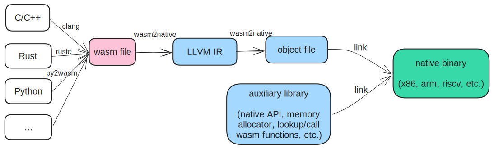

  <h1><code>wasm2native</code></h1>
  

    <strong>Toolchain for compiling WebAssembly to native</strong>
  

### Overview
wasm2native allows to compile the WebAssembly file into a native object file, and then link it with an auxiliary library into the native binary, e.g., executable file, shared library or static library. It removes the wasm runtime dependency and provides two modes:
- sandbox mode: the wasm sandbox is kept, and the wasm address space and native address space are different
- [no-sandbox mode](https://github.com/AndroidWasm/wabt/tree/main/wasm2c#no-sandbox-mode-experimental), the wasm sandbox is discarded but it allows sharing pointers (both memory pointers and function pointers) between wasm and native, and the address space is the same in wasm and native.

{ width=500px height=100px }

### Getting started
- [Build wasm2native](./wasm2native-compiler/README.md)
- [Build auxiliary lib](./wasm2native-vmlib/README.md)
- [Build wasm applications](./doc/build_wasm_app.md)
- [Compile wasm applications to native](./doc/compile_wasm_app_to_native.md)
- [Embed compiled native binary in C/C++](./doc/embed_compiled_native.md)
- [Register native APIs for Wasm applications](./doc/register_native_api.md)
- [Samples](./samples) and [Benchmarks](./tests/benchmarks)

License
=======
wasm2native uses the same license as LLVM: the `Apache 2.0 license` with the LLVM exception. See the LICENSE file for details.
This license allows you to freely use, modify, distribute and sell your own products based on wasm2native.
Any contributions you make will be under the same license.
